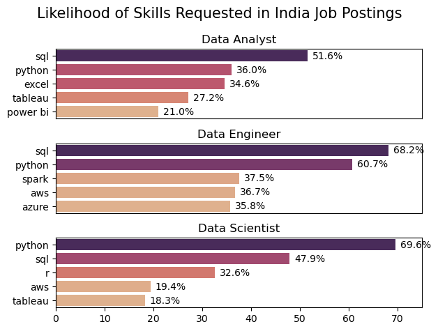
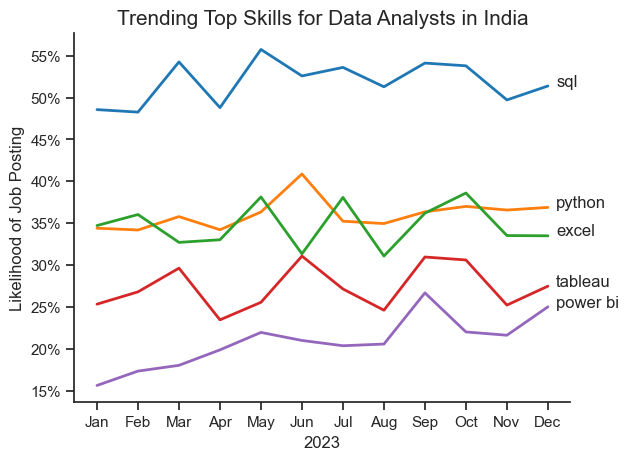

# The Analysis
Each Jupyter notebook for this project aimed at investigating specific aspects of the data job market. Here’s how I approached each question:

## 1. What are the most demanded skills for the top 3 most popular data roles?
To find the most demanded skills for the top 3 most popular data roles. I filtered out those positions which were the most popular, and got the top 5 skills for these top 3 roles. This query highlights the most popular job titles and their top skills, showing which skills I should pay attention to depending on the role I'm targeting.

View my notebook with detailed steps here: [2_Skill_Demand.ipynb](Project/2_Skill_Demand.ipynb)

### Visualize Data

```python
fig, ax = plt.subplots(len(job_titles), 1)

for i, job_title in enumerate(job_titles):
    df_plot = df_skill_perc[df_skill_perc['job_title_short'] == job_title].head(5)
    sns.barplot(data=df_plot, x='skill_percent', y='job_skills', ax=ax[i], hue='skill_percent', palette='flare')

    for n, v in enumerate(df_plot['skill_percent']):
        ax[i].text(v + 1, n, f'{v:.1f}%', va='center')

    if i != len(job_titles) - 1:
        ax[i].set_xticks([])
fig.tight_layout()
plt.show()
```

### Results



*Bar Graph Visualizing the skills requested for Data Analysts in India 2023*

### Insights
* SQL Dominance: SQL is consistently a top requirement across all three roles, emphasizing its importance in the data ecosystem.
* Python's Versatility: Python's growing popularity is evident, particularly in data engineering and data science roles.
* Cloud Adoption: The increasing demand for cloud skills reflects the industry's shift towards cloud-based data solutions.
* Role-Specific Skills: Each role has unique skill requirements, highlighting the need for specialization within the data field.

## 2. How are in-demand skills trending for Data Analysts?

To find how skills are trending in 2023 for Data Analysts, I filtered data analyst positions and grouped the skills by the month of the job postings. This got me the top 5 skills of data analysts by month, showing how popular skills were throughout 2023.

View my notebook with detailed steps here: [3_Skills_Trend.ipynb](Project/3_Skills_Trend.ipynb)

### Visualize Data

```python
from matplotlib.ticker import PercentFormatter
df_plot = df_da_ind_perc.iloc[:, :5]
sns.lineplot(data=df_plot, dashes=False, palette='tab10', linewidth=2)

plt.show()
```

### Results



*Line Graph Visualizing the Trending skills of Data Analysts in India 2023*

### Insights
* SQL Dominance: SQL consistently holds the top position as the most in-demand skill throughout the year, indicating its crucial role in data manipulation and retrieval.
* Python on the Rise: Python's popularity is evident, with a steady increase in demand throughout the year, solidifying its position as a versatile language for data analysis and manipulation.
* Excel's Enduring Importance: Excel remains a core skill, showcasing its value in data cleaning, analysis, and reporting.
* Data Visualization Tools: Tableau and Power BI are essential for data storytelling and insights extraction, reflected in their consistent demand.
