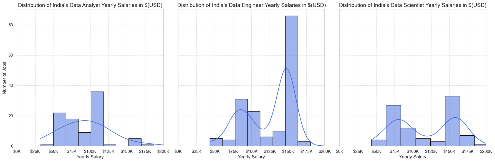

# The Analysis
Each Jupyter notebook for this project aimed at investigating specific aspects of the data job market. Here’s how I approached each question:

## 1. What are the most demanded skills for the top 3 most popular data roles?
To find the most demanded skills for the top 3 most popular data roles. I filtered out those positions which were the most popular, and got the top 5 skills for these top 3 roles. This query highlights the most popular job titles and their top skills, showing which skills I should pay attention to depending on the role I'm targeting.

View my notebook with detailed steps here: [2_Skill_Demand.ipynb](Project/2_Skill_Demand.ipynb)

### Visualize Data

```python
fig, ax = plt.subplots(len(job_titles), 1)

for i, job_title in enumerate(job_titles):
    df_plot = df_skill_perc[df_skill_perc['job_title_short'] == job_title].head(5)
    sns.barplot(data=df_plot, x='skill_percent', y='job_skills', ax=ax[i], hue='skill_percent', palette='flare')

    for n, v in enumerate(df_plot['skill_percent']):
        ax[i].text(v + 1, n, f'{v:.1f}%', va='center')

    if i != len(job_titles) - 1:
        ax[i].set_xticks([])
fig.tight_layout()
plt.show()
```

### Results


*Bar Graph Visualizing the skills requested for Data Analysts in India 2023*

### Insights
* SQL Dominance: SQL is consistently a top requirement across all three roles, emphasizing its importance in the data ecosystem.
* Python's Versatility: Python's growing popularity is evident, particularly in data engineering and data science roles.
* Cloud Adoption: The increasing demand for cloud skills reflects the industry's shift towards cloud-based data solutions.
* Role-Specific Skills: Each role has unique skill requirements, highlighting the need for specialization within the data field.

## 2. How are in-demand skills trending for Data Analysts?

To find how skills are trending in 2023 for Data Analysts, I filtered data analyst positions and grouped the skills by the month of the job postings. This got me the top 5 skills of data analysts by month, showing how popular skills were throughout 2023.

View my notebook with detailed steps here: [3_Skills_Trend.ipynb](Project/3_Skills_Trend.ipynb)

### Visualize Data

```python
from matplotlib.ticker import PercentFormatter
df_plot = df_da_ind_perc.iloc[:, :5]
sns.lineplot(data=df_plot, dashes=False, palette='tab10', linewidth=2)

plt.show()
```

### Results


*Line Graph Visualizing the Trending skills of Data Analysts in India 2023*

### Insights
* SQL Dominance: SQL consistently holds the top position as the most in-demand skill throughout the year, indicating its crucial role in data manipulation and retrieval.
* Python on the Rise: Python's popularity is evident, with a steady increase in demand throughout the year, solidifying its position as a versatile language for data analysis and manipulation.
* Excel's Enduring Importance: Excel remains a core skill, showcasing its value in data cleaning, analysis, and reporting.
* Data Visualization Tools: Tableau and Power BI are essential for data storytelling and insights extraction, reflected in their consistent demand.

## 3. How are the yearly salaries distributed across top 3 job roles?

To identify the top 3 job roles in India, I filtered the dataset with roles having the most number of jobs. Then I looked at there salary distirbutions to get an idea which jobs are paid the most.

View my notebook with detailed steps here: [4_Salary_Analysis.ipynb](Project/4_Salary_Analysis.ipynb)

### Visualize Data

```python
fig, axs = plt.subplots(1, 3, figsize=(18, 6), sharey=True)
sns.histplot(df_da['salary_year_avg'], kde=True, fill=True, ax=axs[0], color='royalblue', edgecolor='black')
sns.histplot(df_de['salary_year_avg'], kde=True, fill=True, ax=axs[1], color='royalblue', edgecolor='black')
sns.histplot(df_ds['salary_year_avg'], kde=True, fill=True, ax=axs[2], color='royalblue', edgecolor='black')

plt.tight_layout()
plt.show()
```
### Results



*Histogram Visualizing the Salary Distribution of Top 3 job roles in India 2023*

### Insights

* The disparity in salary distributions suggests varying levels of skill demand and market value for these roles. Data Engineering skills appear to be in higher demand, leading to premium salaries.
* The data hints at potential career trajectories. Data Analysts might consider upskilling to move into Data Engineering for better compensation.
* The positive skew in all distributions might indicate a larger pool of entry-level to mid-level professionals compared to senior positions with top salaries.

###  Highest Paid & Most Demanded Skills for Data Analysts

Next, I narrowed my analysis and focused only on data analyst roles. I looked at the highest-paid skills and the most in-demand skills. I used two bar charts to showcase these.

### Visualize Data

```python
# Top 10 Highest Paid Skills for Data Analysts
sns.barplot(data=df_DA_top_pay, x='median', y=df_DA_top_pay.index, hue='median', ax=ax[0], palette='flare')

# Top 10 Most In-Demand Skills for Data Analysts')
sns.barplot(data=df_DA_skills, x='median', y=df_DA_skills.index, hue='median', ax=ax[1], palette='flare')

plt.tight_layout()
plt.show()
```

### Results


*Two seperate bar graphs visualizing highest paid and most in-demand skills for Data Analysts in India 2023*

### Insights

* The top graph shows specialized technical skills like pyspark, Postgresql, Gitlab etc are associated with higher salaries, some reaching up to $165K, suggesting that advanced technical proficiency can increase earning potential.
* The bottom graph highlights that `foundational skills` like Excel, Python, and SQL are the most in-demand, even though they may not offer the highest salaries. This demonstrates the importance of these core skills for employability in data analysis roles.
* There's a clear distinction between the skills that are highest paid and those that are most in-demand. Data analysts aiming to maximize their career potential should consider developing a diverse skill set that includes both high-paying specialized skills and widely demanded foundational skills.

## 4. What are the most optimal skills to learn for Data Analysts?

To identify the most optimal skills to learn ( the ones that are the highest paid and highest in demand) I calculated the percent of skill demand and the median salary of these skills. To easily identify which are the most optimal skills to learn.

View my notebook with detailed steps here:  [5_Optimal_Skills.ipynb](Project/5_Optimal_Skills.ipynb)

### Visualize Data

```python
sns.scatterplot(
    data=df_DA_skills_high_demand,
    x='skill_percent',
    y='median_salary',
    color='royalblue',
    marker='o',
    edgecolor='black'
)

adjust_text(texts, arrowprops=dict(arrowstyle='->', color='gray'), force_text=0.5)

from matplotlib.ticker import PercentFormatter
ax = plt.gca()
ax.yaxis.set_major_formatter(plt.FuncFormatter(lambda y, pos: f'${int(y/1000)}K'))
ax.xaxis.set_major_formatter(PercentFormatter(decimals=0))

plt.tight_layout()
plt.show()
```

### Results


*Scatter plot visualizing the most optimal skills(high demand & high paying) for Data Analysts in India*

### Insights

* Skills like `Looker`, `Spark`,`Powerpoint` etc have the highest median salaries despite being less common in job postings.
* More commonly required skills like `SQL`, `Python`, `Excel` have large presence in job listings but less median salaries compared to specialized skills.
*  This suggests that a combination of technical proficiency and soft skills (like those represented by Powerpoint) might be crucial for maximizing earnings.

